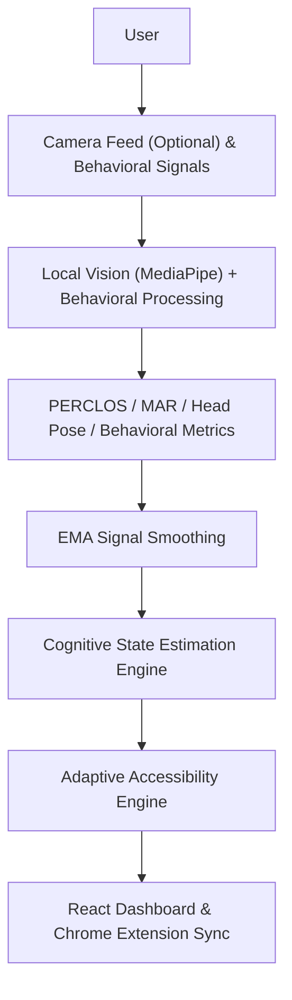
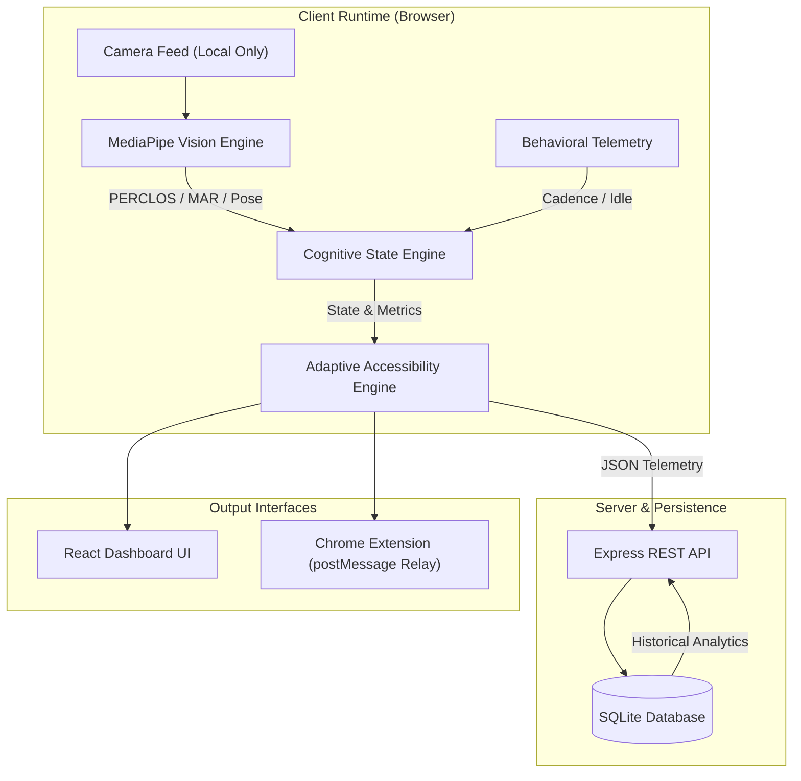

# BioAdaptive

## Cognitive Fatigue Detection & Intelligent Web Accessibility

> BioAdaptive is a privacy-first cognitive-aware computing system that estimates cognitive fatigue, attention, and cognitive load from visual and behavioral signals, then dynamically adapts the digital interface to support a more accessible and focused user experience.

**Sense → Estimate → Adapt**

---

## 1. Project Overview

Traditional web interfaces remain static regardless of the user's changing cognitive state. A user experiencing high mental fatigue or decreased attention interacts with the exact same visual density, layout, and contrast as a fully rested user.

BioAdaptive bridges this gap by integrating:
- **Computer Vision**: Real-time facial landmark and eye tracking using MediaPipe FaceMesh.
- **Behavioral Signals**: Passive tracking of interaction dynamics such as typing cadence, scrolling behavior, and idle intervals.
- **Cognitive-State Estimation**: Mathematical signal processing (PERCLOS, MAR, Head Pose, EMA smoothing) to estimate cognitive fatigue, attention capacity, and workload.
- **Adaptive Accessibility**: Automatic context-sensitive UI transformations (readability scaling, contrast adjustment, Focus Mode, break prompts).

> **Important Disclaimer**: BioAdaptive does **not** claim to diagnose, treat, or prevent any medical or psychological condition. All outputs represent system-estimated cognitive and behavioral metrics derived from observable digital signals.

---

## 2. Problem

Modern digital environments treat every user state identically. When a user experiences:
- Reduced sustained attention
- Prolonged cognitive fatigue
- High mental workload
- Increased distraction

...the interface stays rigid and unchanged. This mismatch increases cognitive strain, elevates error rates, and degrades user experience. BioAdaptive addresses this challenge by continuously analyzing observable indicators to adjust interface ergonomics dynamically.

---

## 3. Solution

BioAdaptive implements a closed-loop **Sense → Estimate → Adapt** pipeline:

```
┌─────────────────┐       ┌──────────────────────┐       ┌────────────────────────┐
│     1. SENSE    │  ───► │     2. ESTIMATE      │  ───► │        3. ADAPT        │
│                 │       │                      │       │                        │
│ Visual &        │       │ Fatigue, Attention,  │       │ UI Ergonomics, Focus,  │
│ Behavioral      │       │ Workload & Recovery  │       │ Readability & Motion   │
└─────────────────┘       └──────────────────────┘       └────────────────────────┘
```

### 1. Sense
Collects observable visual and behavioral metrics completely inside the client environment:
- **Visual Signals**: Eye closure duration, blink frequency, yawning (mouth opening), head orientation.
- **Behavioral Signals**: Typing speed, scrolling velocity, pause intervals, mouse movement patterns.

### 2. Estimate
Processes raw signals into normalized cognitive metrics:
- Estimated Fatigue Index (0–100%)
- Estimated Attention Capacity (%)
- Estimated Cognitive Workload Level
- Recovery Trajectory

### 3. Adapt
Applies real-time accessibility modifications:
- Readability enhancement & font sizing
- High-contrast / reduced-glare theme adjustments
- Focus Mode & distraction filtering
- Motion reduction
- Break and recovery recommendations

---

## 4. How It Works

### Pipeline Flow



### System-Estimated States

BioAdaptive continuously categorizes interaction state into one of five system-estimated states:

1. **`NORMAL`**: Optimal baseline. Attention and fatigue indicators remain within comfortable thresholds.
2. **`REDUCED_ATTENTION`**: Micro-distractions or decreased focal stability detected. Interface streamlines layout to minimize distraction.
3. **`POSSIBLE_FATIGUE`**: Elevated eye closure (PERCLOS) or yawning (MAR) detected. Interface enhances contrast, font size, and suggests short breaks.
4. **`HIGH_COGNITIVE_LOAD`**: Rapid task context switching or irregular behavioral cadence detected. System enables Focus Mode and hides secondary UI elements.
5. **`RECOVERY`**: User indicators stabilize following rest or reduced interaction speed. System gradually restores standard interface density.

---

## 5. AI / Signal Processing

BioAdaptive combines multiple non-invasive observable metrics:

### PERCLOS (Percentage of Eye Closure)
Calculates the proportion of time the eyes remain at least 80% closed within a rolling 60-second observation window. Elevated PERCLOS is a validated indicator of drowsiness and reduced alertness.

### MAR (Mouth Aspect Ratio)
Measures the vertical to horizontal ratio of mouth landmarks to detect sustained mouth opening (yawning frequency).

### Head Pose Estimation
Tracks pitch, yaw, and roll of the head to measure gaze deviation, posture slump, and sustained looking-away intervals.

### Behavioral Signals
Tracks keystroke dynamics, scroll acceleration, and idle gaps to establish an interaction baseline without requiring webcam input.

### Exponential Moving Average (EMA)
Applies EMA smoothing ($S_t = \alpha \cdot Y_t + (1 - \alpha) \cdot S_{t-1}$) to raw metric feeds, eliminating short-term sensor noise and false positive spikes.

---

## 6. Privacy-First Design

Privacy is a core architectural requirement of BioAdaptive:

- **Camera OFF by Default**: The webcam is never activated automatically. It requires explicit user activation.
- **100% Local Processing**: All MediaPipe facial mesh evaluation occurs strictly within the browser JavaScript runtime.
- **Zero Video Transmission**: WebGL/Webcam video frames **never leave the user's browser**. No images or video feeds are ever uploaded or saved.
- **Privacy Mode**: Users can disable camera monitoring entirely. BioAdaptive falls back smoothly to pure behavioral telemetry (typing/scrolling).

> **Privacy Guarantee**: Raw video stays local. Only derived numerical telemetry is transmitted.

---

## 7. Adaptive Accessibility

When cognitive state shifts, BioAdaptive dynamically applies ergonomic accessibility adaptations:

| Adaptation | Trigger State | System Action |
| --- | --- | --- |
| **Readability Booster** | `POSSIBLE_FATIGUE` | Increases font scale, line height, and letter spacing |
| **Focus Mode** | `HIGH_COGNITIVE_LOAD` | Dims secondary panels and suppresses non-essential widgets |
| **Contrast & Motion Control** | `REDUCED_ATTENTION` | Reduces ambient animations and heightens contrast ratios |
| **Recovery Assist** | Sustained Fatigue | Recommends a 5-minute Pomodoro break and voice cue |

---

## 8. Technology Stack

| Layer | Technologies Used |
| --- | --- |
| **Frontend UI** | React 18, TypeScript, Vite, Tailwind CSS, Lucide Icons, Framer Motion |
| **Computer Vision** | MediaPipe FaceMesh (`@mediapipe/face_mesh`), WebGL Shaders, Canvas API |
| **Signal Processing** | PERCLOS, MAR, Head Pose Heuristics, Exponential Moving Average (EMA) |
| **Backend API** | Node.js, Express.js (REST API, CORS) |
| **Database** | SQLite (`sqlite3` engine, lightweight persistent file DB) |
| **Browser Extension** | Chrome Extension Manifest V3, Content Scripts, Background Service Worker |
| **State & Fallback** | React Context API, Browser LocalStorage, Offline Fallback |

---

## 9. System Architecture



---

## 10. Key Features

- **Real-Time Cognitive State Estimation**: Live computation of estimated fatigue, attention capacity, and cognitive load.
- **PERCLOS Eye Tracking**: Precise eye aspect ratio (EAR) analysis for drowsiness detection.
- **MAR Yawn Detection**: Mouth aspect ratio analysis to detect frequency of yawning.
- **Posture & Gaze Tracking**: Head pitch/yaw monitoring to flag slouching and sustained distraction.
- **EMA Fatigue Smoothing**: Noise-filtered trend curves preventing erratic UI jumping.
- **Privacy Mode**: Complete camera-free mode utilizing behavioral signals.
- **Adaptive Accessibility Transformations**: Automated font scaling, contrast shifting, and motion dampening.
- **Pomodoro Focus Timer & Voice Buddy**: Integrated break timer with toggleable audio prompts.
- **Historical Session Analytics**: SQLite-backed session storage, trend charts, and CSV telemetry export.
- **Chrome Extension Synchronization**: Cross-tab accessibility state broadcast via `postMessage`.
- **Demo Mode**: Explicit simulated data mode (`SIMULATED DATA — DEMO MODE`) for live presentations.
- **Offline Resilience**: Seamless fallback to local storage if backend server is disconnected.

---

## 11. Cognitive States

| State | Description | Interface Adaptation |
| --- | --- | --- |
| **`NORMAL`** | Baseline state with balanced attention and fatigue indicators. | Default UI theme and layout density. |
| **`REDUCED_ATTENTION`** | Fluctuating gaze or irregular behavioral cadence detected. | Reduces background animations and sharpens focal contrast. |
| **`POSSIBLE_FATIGUE`** | Sustained eye closure (PERCLOS) or frequent yawning (MAR). | Enforces high readability font sizes and offers break prompts. |
| **`HIGH_COGNITIVE_LOAD`** | Rapid task context switching or heavy interaction speed. | Activates Focus Mode, hiding non-critical sidebars. |
| **`RECOVERY`** | Indicators normalizing after rest or reduced workload. | Smoothly transitions interface back to standard density. |

---

## 12. Project Structure

```text
BioAdaptiveSystem/
├── extension/             # Chrome Extension Manifest V3 (content scripts, popup, background)
│   ├── background.js      # Background service worker & tab state listener
│   ├── content.js         # DOM accessibility manipulator
│   ├── manifest.json      # Extension configuration
│   └── popup.html / js    # Extension popup status interface
├── react-app/             # Main Frontend Application (React + TypeScript + Vite)
│   ├── src/
│   │   ├── components/    # UI components, layout, dashboard, shaders
│   │   ├── context/       # DashboardContext (state management & telemetry pipeline)
│   │   ├── hooks/         # Vision (MediaPipe), Voice, and Analytics custom hooks
│   │   ├── pages/         # Dashboard & Redesigned Login pages
│   │   └── lib/           # REST API client & utilities
│   └── package.json       # React frontend dependencies & build scripts
├── server/                # Backend Server (Node.js + Express + SQLite)
│   ├── db.js              # SQLite database initialization & schema
│   ├── index.js           # REST API routes (telemetry, sessions, analytics)
│   └── package.json       # Server dependencies
├── web-app/               # Static web assets & legacy standalone interface
└── .gitignore             # Git exclusion rules for secrets, DBs, and dependencies
```

---

## 13. Local Setup

### Prerequisites
- **Node.js** (v18.x or higher)
- **npm** (v9.x or higher)

### 1. Clone the Repository
```bash
git clone https://github.com/Aswinkumaar07/BioAdaptive.git
cd BioAdaptive
```

### 2. Start the Backend Server
```bash
cd server
npm install
node index.js
```
*The Express server will start on `http://localhost:3001` and automatically initialize the SQLite database at `server/data/bioadaptive.db`.*

### 3. Start the React Frontend Application
In a new terminal window:
```bash
cd react-app
npm install
npm run dev
```
*The React development server will start on `http://localhost:5173`.*

---

## 14. Production Build

To build the frontend application for production deployment:

```bash
cd react-app
npm run build
```

This compiles the TypeScript code and bundles static assets into `react-app/dist`.

---

## 15. Demo Mode

BioAdaptive includes a built-in **Demo Mode** for demonstrations:

1. Open the application dashboard at `http://localhost:5173`.
2. Toggle the **Demo Mode** switch in the control panel.
3. The system clearly displays **`SIMULATED DATA — DEMO MODE`** and cycles through the five cognitive states:
   $$\text{NORMAL} \longrightarrow \text{REDUCED\_ATTENTION} \longrightarrow \text{POSSIBLE\_FATIGUE} \longrightarrow \text{HIGH\_COGNITIVE\_LOAD} \longrightarrow \text{RECOVERY}$$

---

## 16. Chrome Extension

The Chrome Extension allows BioAdaptive to project accessibility adaptations across external browser tabs:

1. Open Chrome and navigate to `chrome://extensions`.
2. Enable **Developer mode** in the top-right corner.
3. Click **Load unpacked** and select the `extension/` directory inside `BioAdaptiveSystem`.
4. The extension synchronizes accessibility state with the BioAdaptive dashboard in real time.

---

## 17. Privacy & Security Note

> **Privacy Statement**: BioAdaptive is designed as a privacy-first prototype. Camera processing occurs locally in the browser, and raw video frames are not transmitted to or stored by the backend.

> **Scope Disclaimer**: BioAdaptive is an adaptive accessibility platform. It is not a medical diagnostic system.

---

## 18. Project Purpose

> BioAdaptive explores how digital interfaces can become more responsive to observable changes in user attention and cognitive workload while keeping privacy at the center of the design.

## Sense → Estimate → Adapt
